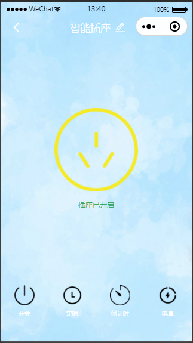

# ZcSmartHome
This project is developed using Tuya SDK, which enables you to quickly develop branded apps connecting and controlling smart scenarios of many devices. For more information, please check Tuya Developer Website.

基于涂鸦平台的智能家居控制小程序

